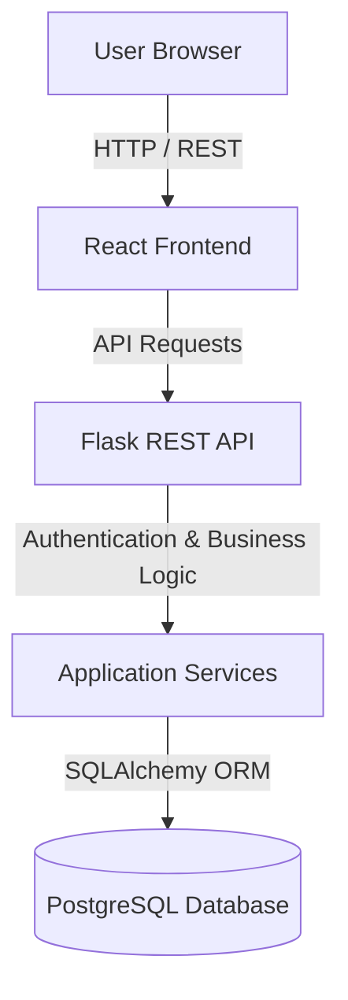
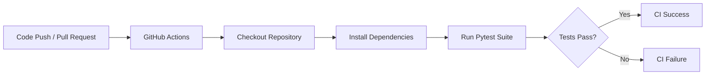
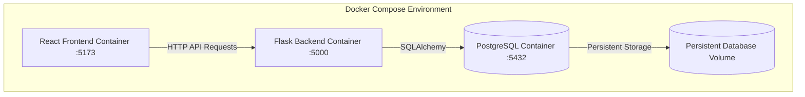
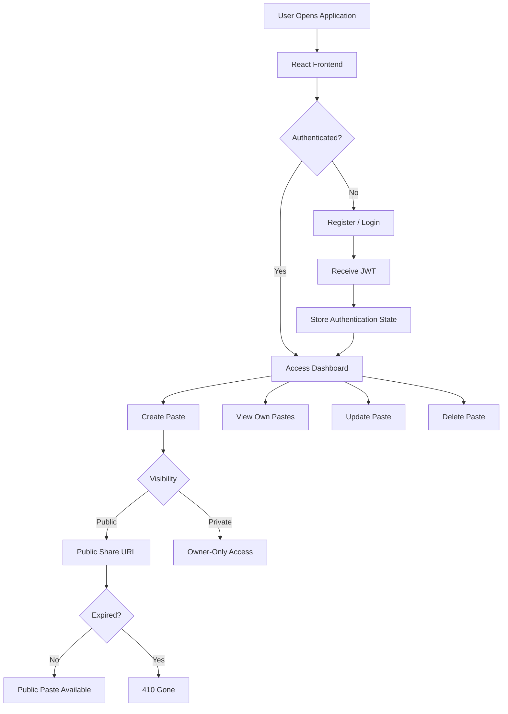

# PasteVault

[](https://github.com/YOUR_USERNAME/paste-bin/actions)
[](#license)

> A full-stack, containerized Pastebin-style platform for creating, storing, managing, and securely sharing text and code snippets.

---

## Table of Contents

* [Overview](#overview)
* [Key Features](#key-features)
* [Tech Stack](#tech-stack)
* [System Architecture](#system-architecture)
* [Project Structure](#project-structure)
* [Prerequisites](#prerequisites)
* [Quick Start with Docker Compose](#quick-start-with-docker-compose)
* [Environment Variables](#environment-variables)
* [Local Development](#local-development)
* [Database Migrations](#database-migrations)
* [API Documentation](#api-documentation)
* [API Feature Coverage](#api-feature-coverage)
* [Health Check](#health-check)
* [Testing](#testing)
* [API Testing](#api-testing)
* [CI/CD](#cicd)
* [Docker Architecture](#docker-architecture)
* [Application Workflow](#application-workflow)
* [Development Workflow](#development-workflow)
* [Security](#security)
* [Known Limitations](#known-limitations)
* [Future Improvements](#future-improvements)
* [Project Status](#project-status)
* [License](#license)

---

## Overview

**PasteVault** is a full-stack, Pastebin-style platform designed for creating, storing, retrieving, managing, and sharing text and code snippets.

The application provides a React-based frontend and a Flask REST API backend, with PostgreSQL used for persistent data storage through SQLAlchemy.

The platform supports:

* Secure user registration and authentication
* JWT-based authorization
* Paste creation and management
* Public and private paste visibility
* Ownership-based access control
* Optional paste expiration
* Pagination for paste listings
* PostgreSQL persistence
* Database schema migrations
* Docker-based development and deployment environments
* Automated backend testing with Pytest
* Continuous Integration through GitHub Actions

The project is structured to demonstrate practical **full-stack development, REST API design, database integration, authentication, containerization, automated testing, and DevOps practices**.

---

## Key Features

### Authentication

* User registration
* Login using username or email
* JWT-based authentication
* Protected API routes
* Authenticated user information endpoint

### Paste Management

* Create text and code snippets
* Retrieve individual pastes
* List user-owned pastes
* Update existing pastes
* Delete pastes
* Support for programming language metadata

### Access Control & Sharing

* Public paste sharing
* Private pastes
* Public access endpoint for shareable pastes
* Ownership-based authorization
* Users cannot modify or delete pastes owned by another user

### Paste Expiration

* Optional expiration timestamp
* Future-expiring pastes remain accessible before expiration
* Expired pastes return `410 Gone` through the public access flow

### Pagination

* Paginated paste listing
* Page selection
* Configurable records per page
* Validation of pagination parameters

### Database & Persistence

* PostgreSQL relational database
* SQLAlchemy ORM
* Flask-Migrate / Alembic database migrations
* Persistent Docker database volume

### DevOps & Infrastructure

* Dockerized frontend
* Dockerized backend
* PostgreSQL container
* Docker Compose orchestration
* Persistent database volume
* GitHub Actions CI pipeline
* Automated Pytest execution

---

## Tech Stack

| Layer                 | Technology                                      |
| :-------------------- | :---------------------------------------------- |
| **Frontend**          | React, Vite                                     |
| **Backend**           | Python, Flask                                   |
| **API**               | Flask REST API                                  |
| **Database**          | PostgreSQL                                      |
| **ORM**               | SQLAlchemy                                      |
| **Migrations**        | Flask-Migrate, Alembic                          |
| **Authentication**    | JWT (JSON Web Tokens)                           |
| **Testing**           | Pytest                                          |
| **Containerization**  | Docker                                          |
| **Orchestration**     | Docker Compose                                  |
| **CI**                | GitHub Actions                                  |
| **API Documentation** | Markdown API Documentation / OpenAPI or Swagger |

---

## System Architecture

The application follows a layered full-stack architecture.



### Architecture Responsibilities

| Component                | Responsibility                                                              |
| :----------------------- | :-------------------------------------------------------------------------- |
| **React Frontend**       | User interface and client-side interaction                                  |
| **Flask REST API**       | HTTP routing, validation, authentication, authorization, and business logic |
| **Application Services** | Reusable application-level operations                                       |
| **SQLAlchemy**           | ORM-based database interaction                                              |
| **PostgreSQL**           | Persistent relational data storage                                          |
| **Docker Compose**       | Multi-container application orchestration                                   |
| **GitHub Actions**       | Automated CI and test execution                                             |

---

## Project Structure

```text
paste-bin/
│
├── backend/
│   ├── app/
│   │   ├── models/
│   │   ├── routes/
│   │   ├── utils/
│   │   └── ...
│   │
│   ├── migrations/
│   │
│   ├── tests/
│   │   ├── __init__.py
│   │   ├── conftest.py
│   │   ├── test_auth.py
│   │   ├── test_health.py
│   │   └── test_pastes.py
│   │
│   ├── Dockerfile
│   ├── .dockerignore
│   ├── requirements.txt
│   └── run.py
│
├── frontend/
│   ├── src/
│   │   ├── assets/
│   │   ├── components/
│   │   ├── context/
│   │   ├── hooks/
│   │   ├── layouts/
│   │   ├── pages/
│   │   ├── services/
│   │   └── utils/
│   │
│   ├── Dockerfile
│   ├── .dockerignore
│   ├── package.json
│   └── vite.config.js
│
├── docs/
│   └── API_DOCUMENTATION.md
│
├── .github/
│   └── workflows/
│       └── ci.yml
│
├── docker-compose.yml
├── .env.example
├── .gitignore
└── README.md
```

---

## Prerequisites

To run PasteVault locally, ensure the following are installed:

* **Docker Desktop** — recommended for running the complete application
* **Python 3.12+** — required for local backend development
* **Node.js 20+** — required for local frontend development
* **PostgreSQL** — required only when running the database outside Docker
* **Git** — required to clone and manage the repository

---

# Quick Start with Docker Compose

Docker Compose is the recommended method for running the complete PasteVault application.

## 1. Clone the Repository

```bash
git clone <your-repository-url>
cd paste-bin
```

---

## 2. Configure Environment Variables

Create a `.env` file in the project root based on `.env.example`.

Example:

```env
# Database Configuration
POSTGRES_DB=pastevault
POSTGRES_USER=pastevault_user
POSTGRES_PASSWORD=your_secure_password

# Application Database URL
DATABASE_URL=postgresql://pastevault_user:your_secure_password@db:5432/pastevault

# Security
JWT_SECRET_KEY=your_secure_jwt_secret
```

> **Important:** Never commit your actual `.env` file or production secrets to version control.

---

## 3. Build and Start the Application

```bash
docker compose up --build
```

The application will start the required containers.

---

## 4. Access the Services

| Service          | URL                              |
| :--------------- | :------------------------------- |
| **Frontend**     | http://localhost:5173            |
| **Backend API**  | http://localhost:5000            |
| **Health Check** | http://localhost:5000/api/health |
| **PostgreSQL**   | localhost:5432                   |

---

## 5. Stop the Application

```bash
docker compose down
```

PostgreSQL data is stored in a Docker named volume and will persist across normal container restarts.

To remove containers **and** the associated volumes:

```bash
docker compose down -v
```

> **Warning:** Removing the volume deletes the persisted PostgreSQL data.

---

# Environment Variables

The application uses environment variables for configuration and sensitive values.

Create a `.env` file based on `.env.example`.

```env
# Database Configuration
POSTGRES_DB=pastevault
POSTGRES_USER=pastevault_user
POSTGRES_PASSWORD=your_secure_password

# Application Database Connection
DATABASE_URL=postgresql://pastevault_user:your_secure_password@db:5432/pastevault

# JWT Configuration
JWT_SECRET_KEY=your_secure_jwt_secret
```

### Environment Variable Reference

| Variable            | Purpose                            |
| :------------------ | :--------------------------------- |
| `POSTGRES_DB`       | PostgreSQL database name           |
| `POSTGRES_USER`     | PostgreSQL database user           |
| `POSTGRES_PASSWORD` | PostgreSQL database password       |
| `DATABASE_URL`      | SQLAlchemy database connection URL |
| `JWT_SECRET_KEY`    | Secret key used for JWT security   |

### Security Requirements

Never commit the following to Git:

* `.env`
* Database passwords
* JWT secret keys
* Production credentials
* Private API keys

Use `.env.example` to document required configuration without exposing real secrets.

---

# Local Development

Docker Compose is recommended, but the frontend and backend can also be run independently.

## Backend

```bash
cd backend
```

Create a virtual environment:

```bash
python -m venv venv
```

Activate the virtual environment.

### Windows

```bash
venv\Scripts\activate
```

### macOS / Linux

```bash
source venv/bin/activate
```

Install dependencies:

```bash
pip install -r requirements.txt
```

Start the Flask backend:

```bash
python run.py
```

Backend API:

```text
http://localhost:5000
```

---

## Frontend

Open a separate terminal:

```bash
cd frontend
```

Install dependencies:

```bash
npm install
```

Start the Vite development server:

```bash
npm run dev
```

Frontend:

```text
http://localhost:5173
```

---

# Database Migrations

PasteVault uses **Flask-Migrate**, powered by **Alembic**, to manage database schema changes.

## Generate a Migration

After modifying the SQLAlchemy models:

```bash
flask --app run.py db migrate -m "describe your change"
```

Review the generated migration before applying it.

---

## Apply Migrations

```bash
flask --app run.py db upgrade
```

Migration history is stored in:

```text
backend/migrations/
```

### Recommended Migration Workflow

```text
Modify SQLAlchemy Model
        ↓
Generate Migration
        ↓
Review Migration
        ↓
Run Migration
        ↓
Test Application
```

Avoid manually modifying the production database schema when the change can be represented through a migration.

---

# API Documentation

The complete API reference is maintained separately from this README.

It documents:

* Authentication
* JWT Bearer token usage
* User registration
* Login using username or email
* Protected routes
* Paste CRUD operations
* Public and private paste visibility
* Ownership authorization
* Pagination
* Paste expiration
* Request examples
* API workflows
* Expected HTTP status codes
* Security considerations
* API testing coverage

### API Documentation

👉 **[View Complete API Documentation](docs/API_DOCUMENTATION.md)**

### API Base URL

```text
http://127.0.0.1:5000
```

### API Prefix

```text
/api
```

### Authentication

Protected endpoints use JWT Bearer authentication:

```http
Authorization: Bearer <access_token>
```

---

# API Feature Coverage

The current API provides the following core operations:

| Category       | Method   | Endpoint                        |
| :------------- | :------- | :------------------------------ |
| Register       | `POST`   | `/api/auth/register`            |
| Login          | `POST`   | `/api/auth/login`               |
| Current User   | `GET`    | `/api/auth/me`                  |
| Create Paste   | `POST`   | `/api/pastes`                   |
| List Pastes    | `GET`    | `/api/pastes`                   |
| Retrieve Paste | `GET`    | `/api/pastes/{paste_id}`        |
| Update Paste   | `PUT`    | `/api/pastes/{paste_id}`        |
| Delete Paste   | `DELETE` | `/api/pastes/{paste_id}`        |
| Public Paste   | `GET`    | `/api/pastes/public/{paste_id}` |
| Health Check   | `GET`    | `/api/health`                   |

---

# Health Check

The application provides a health check endpoint for monitoring API and database connectivity.

### Endpoint

```http
GET /api/health
```

### Local URL

```text
http://localhost:5000/api/health
```

### Example Response

```json
{
  "database": "connected",
  "message": "PasteVault API is running",
  "status": "ok"
}
```

A successful health check indicates that the API is running and the application can communicate with the configured database.

---

# Testing

The backend test suite uses **Pytest** to validate critical application behavior.

The test suite includes coverage for areas such as:

* Authentication
* User registration
* User login
* Protected routes
* Health checks
* Paste CRUD operations
* Authorization
* Public/private visibility
* Pagination
* Paste expiration

Tests use an isolated test database configuration to prevent test execution from modifying development or production data.

---

## Run Tests Locally

```bash
cd backend
pytest -v
```

---

## Run Tests in Docker

```bash
docker exec -it pastevault-backend pytest -v
```

> The exact Docker container name may differ depending on the `docker-compose.yml` configuration.

---

## Recommended Test Workflow

Before creating a pull request:

```bash
cd backend
pytest -v
```

All tests should pass before pushing changes.

---

# API Testing

In addition to automated backend tests, the API has been manually tested against the main functional and security workflows.

### Authentication Testing

* User registration
* Login using username
* Login using email
* Protected endpoint without JWT
* Protected endpoint with JWT

### Paste Testing

* Create paste
* List pastes
* Retrieve paste
* Update paste
* Delete paste

### Visibility Testing

* Public paste retrieval
* Change public paste to private
* Verify private paste cannot be accessed publicly

### Authorization Testing

* User A creates a paste
* User B authenticates
* User B attempts to update User A's paste
* User B attempts to delete User A's paste
* Unauthorized operations are expected to return `403 Forbidden`

### Pagination Testing

* Default pagination
* Custom page number
* Custom `per_page`
* Invalid page parameter
* Excessive `per_page` value

### Expiration Testing

* Future expiration
* Access before expiration
* Already-expired paste
* Access to expired paste
* Expected expired response: `410 Gone`

These scenarios validate the core API behavior across authentication, CRUD operations, authorization, visibility, pagination, and expiration.

For complete request examples and API workflows, see:

👉 **[API Documentation](docs/API_DOCUMENTATION.md)**

---

# CI/CD

PasteVault uses **GitHub Actions** for Continuous Integration.

The CI pipeline is triggered by repository events such as:

* Pushes to the main branch
* Pull requests

The pipeline performs automated validation such as:

1. Checkout source code
2. Set up the required runtime
3. Install dependencies
4. Run automated tests
5. Report success or failure



> **Current CI Scope:** The current pipeline is focused on automated testing and code quality assurance. It is not configured as a production deployment pipeline.

---

# Docker Architecture

PasteVault is orchestrated using Docker Compose to provide a consistent multi-container development environment.



### Container Responsibilities

| Container           | Responsibility                    |
| :------------------ | :-------------------------------- |
| **Frontend**        | Serves the React/Vite application |
| **Backend**         | Runs the Flask REST API           |
| **PostgreSQL**      | Stores application data           |
| **Database Volume** | Persists PostgreSQL data          |

---

# Application Workflow

The primary application workflow is:



---

# Development Workflow

The recommended development workflow is:

```text
1. Create Feature Branch
        ↓
2. Implement Changes
        ↓
3. Run Local Tests
        ↓
4. Commit Changes
        ↓
5. Push Branch
        ↓
6. Open Pull Request
        ↓
7. GitHub Actions Runs CI
        ↓
8. Review Code
        ↓
9. Merge into main
```

### Create a Feature Branch

```bash
git checkout -b feature/your-feature
```

### Run Tests

```bash
cd backend
pytest -v
```

### Commit Changes

```bash
git add .
git commit -m "feat: describe your feature"
```

### Push Branch

```bash
git push origin feature/your-feature
```

### Pull Request

Open a Pull Request against the `main` branch.

Before merging:

* CI checks should pass
* Code should be reviewed
* Tests should pass
* No secrets should be committed
* Database migrations should be reviewed

---

# Security

PasteVault implements several security mechanisms.

### JWT Authentication

Protected API endpoints use stateless JWT-based authentication.

```http
Authorization: Bearer <access_token>
```

---

### Password Security

User passwords should be stored using secure cryptographic password hashing rather than plaintext storage.

---

### Access Control

Paste ownership is enforced for sensitive operations.

Users should not be able to:

* Modify another user's paste
* Delete another user's paste
* Access private pastes through public sharing endpoints

Unauthorized ownership operations are expected to return:

```text
403 Forbidden
```

---

### Environment Isolation

Sensitive configuration values are stored through environment variables.

Production secrets must not be committed to Git.

---

### Test Isolation

The automated test suite uses an isolated test database configuration to prevent test operations from modifying development or production data.

---

### Token Security

JWT access tokens should be treated as sensitive credentials.

Do not:

* Commit tokens to Git
* Hard-code tokens in application source code
* Publish real tokens in documentation
* Share tokens publicly
* Log tokens unnecessarily

Use placeholders in documentation:

```text
<access_token>
```

---

# Known Limitations

The current implementation has the following known limitations or areas that may be expanded in future versions:

* CI currently performs automated testing but does not perform automated production deployment.
* The application currently uses a local development API base URL.
* Production infrastructure and deployment configuration are not yet included.
* Rate limiting is not currently documented as part of the API.
* Advanced search and filtering are not currently available.
* Analytics and usage metrics are not currently implemented.
* Redis caching is not currently implemented.
* Production reverse-proxy configuration is not currently included.

---

# Future Improvements

Potential future improvements include:

### Advanced Analytics

Track:

* Paste views
* Paste popularity
* User activity
* Usage metrics

### Search and Filtering

Add support for:

* Search by title
* Search by language
* Filter by visibility
* Filter by creation date

### Caching

Introduce Redis for high-frequency public paste retrieval and improved performance.

### Rate Limiting

Add API rate limiting to protect endpoints against abuse and excessive traffic.

### Production Deployment

Introduce:

* Production-grade reverse proxy
* HTTPS
* Production database configuration
* Container registry
* Automated deployment pipeline
* Environment-specific configurations

### Enhanced Syntax Highlighting

Expand frontend support for additional programming languages and improved code presentation.

### API Standardization

Introduce a formal OpenAPI specification and interactive Swagger UI for machine-readable API documentation.

---

## Documentation

- [API Documentation](docs/API_DOCUMENTATION.md)
- [System Architecture](docs/ARCHITECTURE.md)

# Project Status

**Status: Complete — Core Technical Challenge Requirements Implemented**

PasteVault currently demonstrates a functioning full-stack application with:

* React frontend
* Flask REST API
* PostgreSQL persistence
* SQLAlchemy ORM
* JWT authentication
* Paste CRUD operations
* Public/private paste access
* Ownership-based authorization
* Paste expiration handling
* Pagination
* Database migrations
* Docker containerization
* Docker Compose orchestration
* Automated Pytest testing
* GitHub Actions CI

The project is structured as a technical demonstration of full-stack application development and DevOps practices.

Production deployment, advanced observability, rate limiting, caching, and automated deployment can be introduced as future improvements.

---

# License

This project was developed as part of a **Full Stack & DevOps technical challenge**.

The project is provided for evaluation and demonstration purposes.

See the repository for the applicable challenge-specific licensing terms.
