# PasteVault System Architecture

## 1. Architecture Overview

PasteVault is a full-stack web application built using a layered architecture.

The system consists of:

* **React + Vite frontend** for the user interface
* **Flask REST API** for backend application logic
* **SQLAlchemy ORM** for database interaction
* **PostgreSQL** for persistent data storage
* **JWT** for stateless authentication and authorization
* **Flask-Migrate / Alembic** for database schema migrations
* **Docker Compose** for multi-container application orchestration
* **GitHub Actions** for continuous integration and automated testing

The architecture separates presentation, API, business logic, data access, and persistence concerns to maintain a modular and maintainable application structure.

---

# 2. High-Level System Architecture

```mermaid
flowchart TD

    U["User / Client Browser"]

    F["React Frontend\nVite\nPort 5173"]

    API["Flask REST API\nPort 5000"]

    AUTH["JWT Authentication\nAuthorization"]

    BL["Application Logic\nValidation & Access Control"]

    ORM["SQLAlchemy ORM"]

    DB[("PostgreSQL Database\nPort 5432")]

    MIG["Flask-Migrate\nAlembic"]

    VOL[("Persistent Docker Volume")]

    U -->|HTTP / HTTPS| F

    F -->|REST API Requests| API

    API --> AUTH

    API --> BL

    BL --> ORM

    ORM -->|SQL Queries| DB

    MIG -->|Schema Migrations| DB

    DB --> VOL
````

---

# 3. Component Architecture

The system is divided into the following major components:

```mermaid
flowchart LR

    subgraph Client_Layer
        A["User Browser"]
    end

    subgraph Presentation_Layer
        B["React Application"]
        C["Vite Development Server"]
    end

    subgraph Application_Layer
        D["Flask REST API"]
        E["Route / Controller Layer"]
        F["Authentication & Authorization"]
        G["Business Logic"]
        H["Validation"]
    end

    subgraph Data_Access_Layer
        I["SQLAlchemy ORM"]
        J["Application Models"]
    end

    subgraph Persistence_Layer
        K[("PostgreSQL")]
    end

    subgraph Infrastructure_Layer
        L["Docker"]
        M["Docker Compose"]
        N["Persistent Volume"]
    end

    subgraph CI_Layer
        O["GitHub Actions"]
        P["Pytest"]
    end

    A --> B
    B --> C
    B --> D

    D --> E
    E --> F
    E --> G
    G --> H

    G --> I
    I --> J
    I --> K

    K --> N

    M --> L
    L --> B
    L --> D
    L --> K

    O --> P
    P --> D
```

---

# 4. Request Flow

A typical request flows through the application as follows:

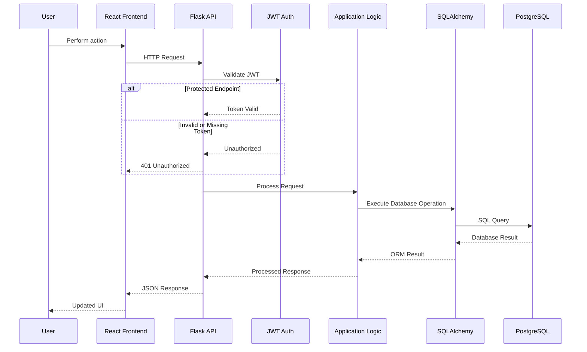

---

# 5. Authentication Flow

PasteVault uses JWT-based stateless authentication.

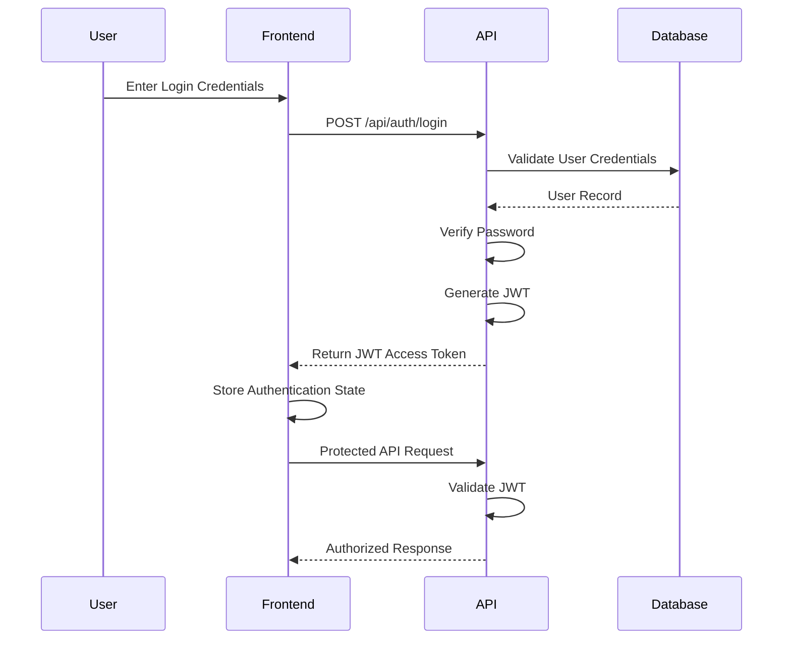

### Authentication Model

```text
User Credentials
       │
       ▼
POST /api/auth/login
       │
       ▼
Credential Verification
       │
       ▼
JWT Access Token
       │
       ▼
Authorization Header
       │
       ▼
Protected API Endpoint
       │
       ▼
JWT Validation
       │
       ├── Valid ──────► Continue Request
       │
       └── Invalid ────► 401 Unauthorized
```

Protected requests use:

```http
Authorization: Bearer <access_token>
```

---

# 6. Paste Creation Flow

The paste creation workflow is:

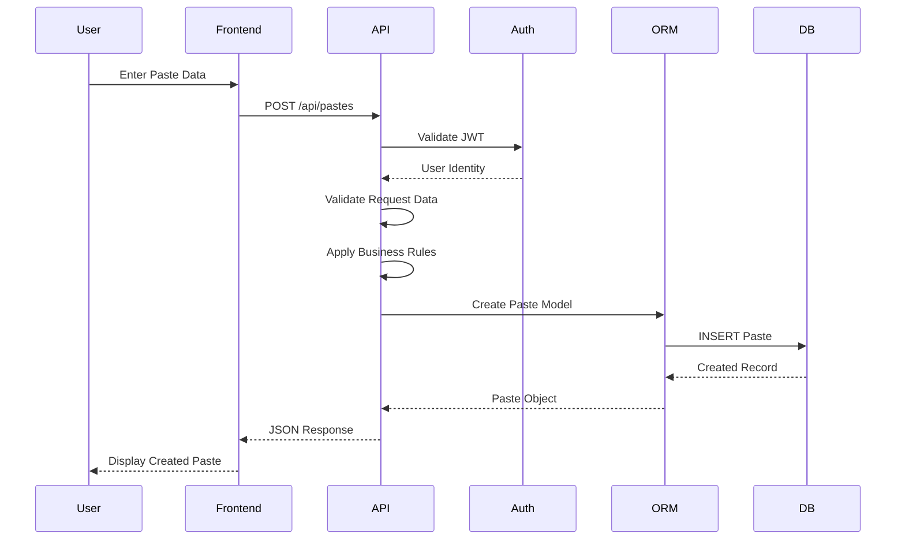

---

# 7. Paste Retrieval Flow

## Authenticated Paste Retrieval

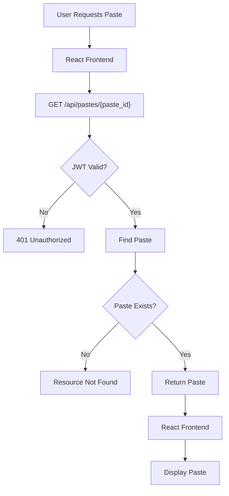

---

# 8. Public Paste Sharing Flow

Public pastes can be accessed through a dedicated public endpoint.

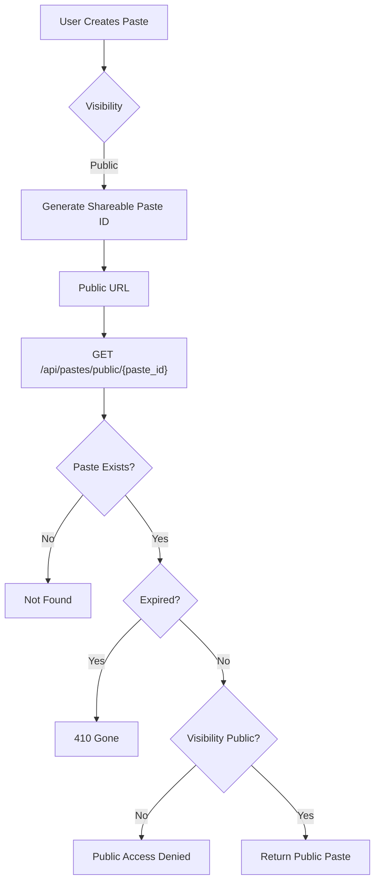

---

# 9. Private Paste Access Control

Private pastes are protected from public access.

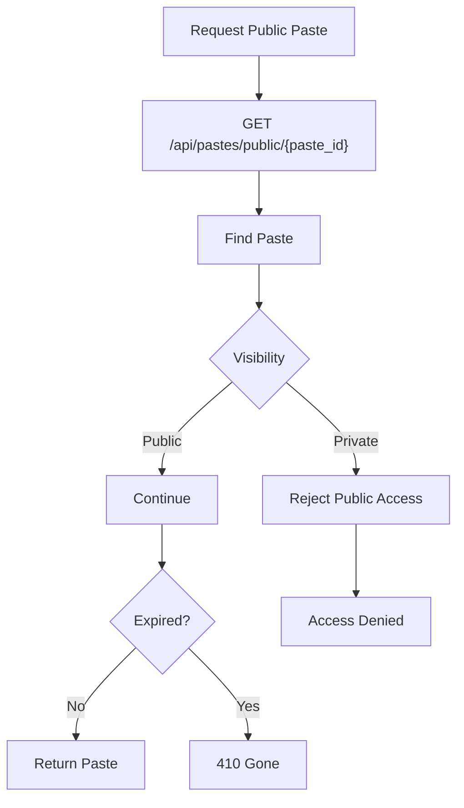

The visibility state controls whether a paste can be accessed through the public sharing endpoint.

---

# 10. Ownership Authorization

PasteVault uses ownership-based authorization for modification and deletion operations.

The ownership check follows this model:

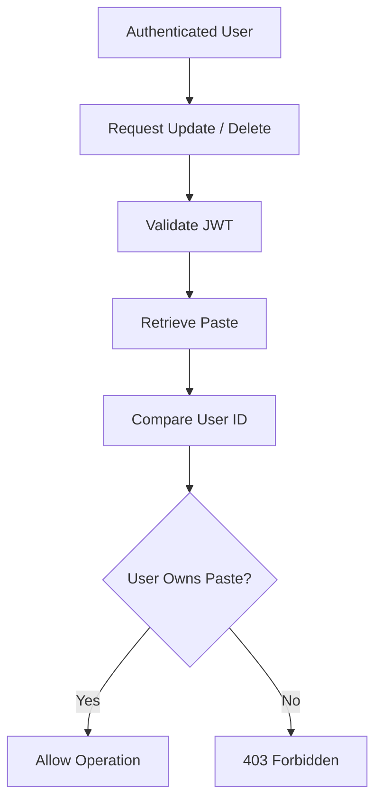

### Authorization Rule

```text
Authenticated User ID
        │
        ▼
Compare with Paste Owner ID
        │
        ├── Match
        │     │
        │     ▼
        │  Allow Operation
        │
        └── No Match
              │
              ▼
         403 Forbidden
```

This prevents one authenticated user from modifying or deleting another user's paste.

---

# 11. Paste Expiration Architecture

Paste expiration is handled using an expiration timestamp.

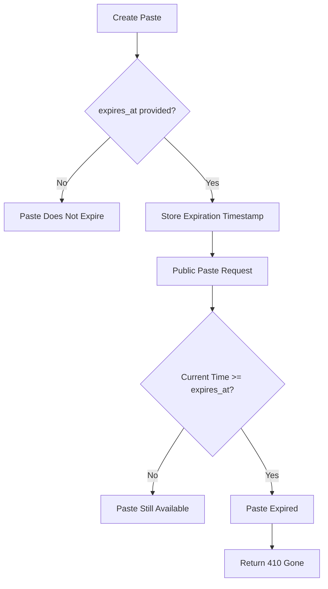

### Expiration States

| State             | Behavior                                                                |
| :---------------- | :---------------------------------------------------------------------- |
| No expiration     | Paste remains available according to visibility and authorization rules |
| Future expiration | Paste remains available until expiration                                |
| Expired           | Public access returns `410 Gone`                                        |

---

# 12. Pagination Architecture

Paste listing supports paginated requests.

Example:

```http
GET /api/pastes?page=1&per_page=10
```

The request flow is:

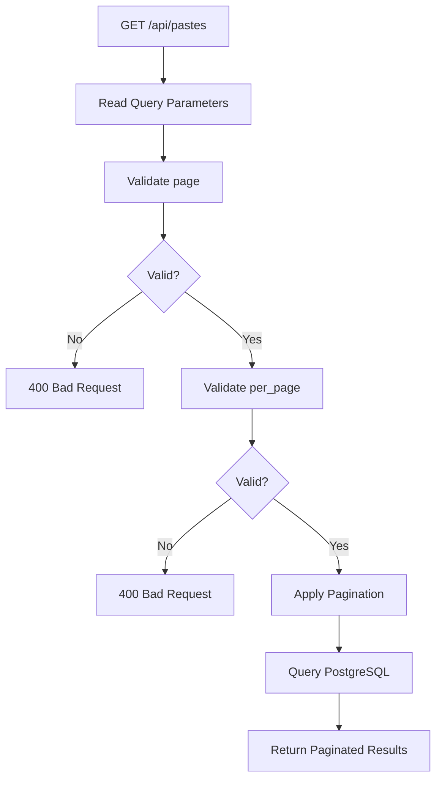

Pagination reduces the amount of data returned by a single request and improves API performance when users have many pastes.

---

# 13. Database Architecture

PostgreSQL is the persistent data store for PasteVault.

SQLAlchemy provides the ORM layer between the Flask application and PostgreSQL.

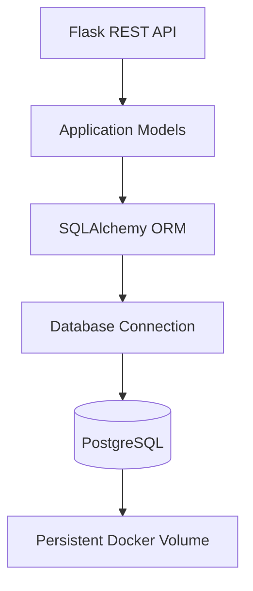

### Database Responsibilities

PostgreSQL stores persistent application data such as:

* User accounts
* Password hashes
* Paste records
* Paste ownership
* Paste visibility
* Paste language metadata
* Paste expiration information
* Creation and update timestamps

The exact database schema is defined by the SQLAlchemy models and managed through database migrations.

---

# 14. Database Migration Architecture

Database schema changes are managed through Flask-Migrate and Alembic.

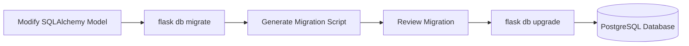

### Migration Workflow

```text
Developer Changes Model
        │
        ▼
Generate Migration
        │
        ▼
Review Migration File
        │
        ▼
Apply Migration
        │
        ▼
Database Schema Updated
```

Migration files are maintained in:

```text
backend/migrations/
```

---

# 15. Docker Architecture

PasteVault runs as a multi-container application using Docker Compose.

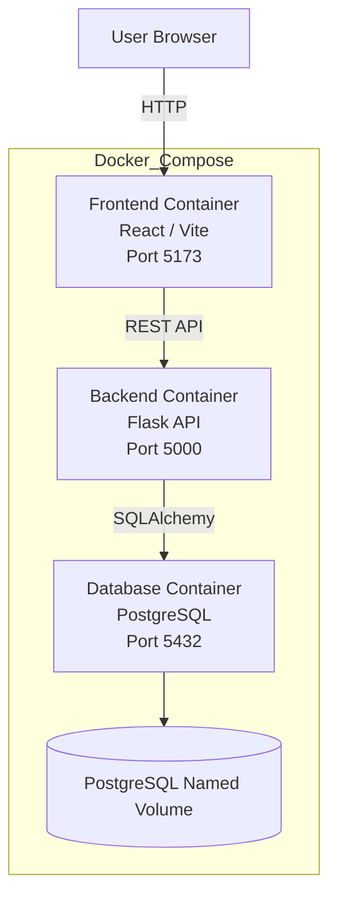

### Container Responsibilities

| Container    | Responsibility                     |
| :----------- | :--------------------------------- |
| Frontend     | Serves the React application       |
| Backend      | Runs Flask REST API                |
| PostgreSQL   | Stores persistent application data |
| Named Volume | Persists database data             |

---

# 16. Docker Startup Flow

When the application is started using:

```bash
docker compose up --build
```

the environment is initialized as follows:

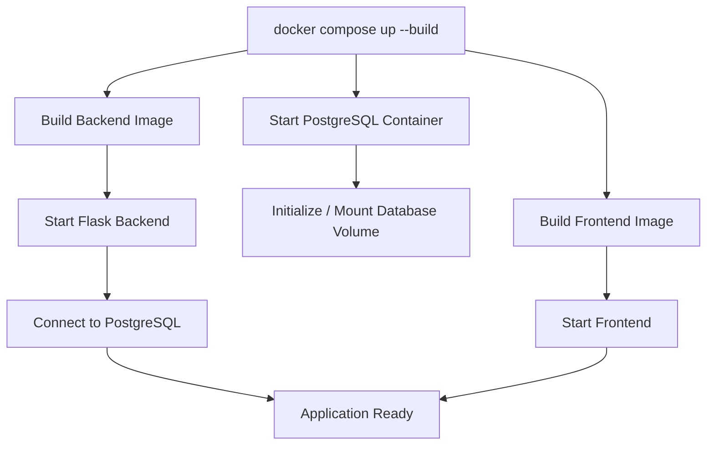

---

# 17. Health Check Architecture

The health endpoint provides a simple mechanism to verify application availability and database connectivity.

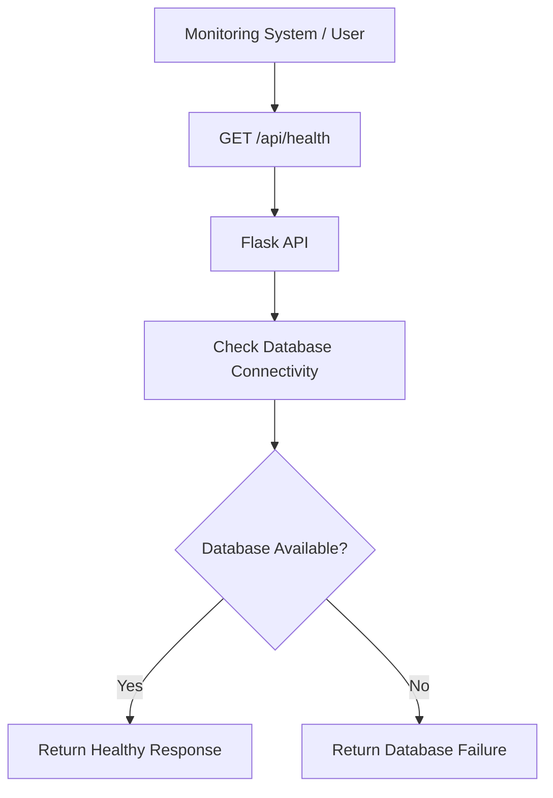

Example healthy response:

```json
{
  "database": "connected",
  "message": "PasteVault API is running",
  "status": "ok"
}
```

---

# 18. Testing Architecture

PasteVault uses Pytest for backend automated testing.

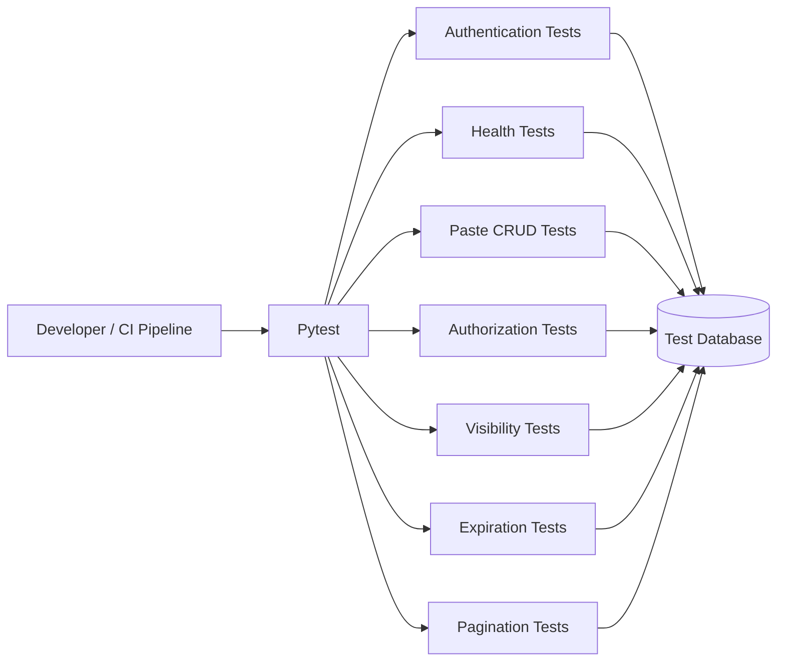

The test environment should remain isolated from development and production databases.

---

# 19. CI Architecture

GitHub Actions provides continuous integration.

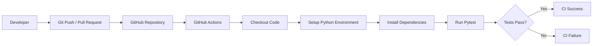

### CI Responsibilities

The CI pipeline validates that:

* Dependencies can be installed
* The application test suite executes successfully
* Changes do not break existing functionality

The current CI pipeline is focused on testing and validation rather than automated production deployment.

---

# 20. Complete End-to-End Architecture

The complete system can be represented as:

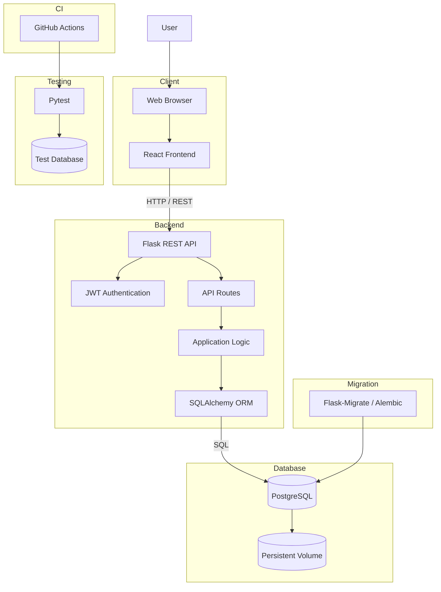

---

# 21. Data Flow Summary

The main data flow through PasteVault is:

```text
User
 │
 ▼
React Frontend
 │
 │ HTTP / REST
 ▼
Flask REST API
 │
 ├── JWT Authentication
 │
 ├── Request Validation
 │
 ├── Authorization
 │
 └── Business Logic
          │
          ▼
    SQLAlchemy ORM
          │
          ▼
      PostgreSQL
          │
          ▼
   Persistent Storage
```

For public paste sharing:

```text
Public User
     │
     ▼
Public Paste URL
     │
     ▼
Flask Public Endpoint
     │
     ├── Check Paste Exists
     │
     ├── Check Visibility
     │
     ├── Check Expiration
     │
     └── Return Paste
```

For protected paste management:

```text
Authenticated User
        │
        ▼
JWT Bearer Token
        │
        ▼
Flask API
        │
        ▼
JWT Validation
        │
        ▼
Ownership Validation
        │
        ├── Owner ──────► Allow
        │
        └── Not Owner ──► 403 Forbidden
```

---

# 22. Architecture Principles

PasteVault follows these architectural principles:

### Separation of Concerns

Frontend, backend, database, testing, and infrastructure responsibilities are separated.

### Stateless Authentication

JWT tokens allow the API to authenticate requests without maintaining traditional server-side session state.

### Persistent Data Storage

PostgreSQL provides reliable persistent relational storage.

### ORM-Based Database Access

SQLAlchemy abstracts database operations and provides structured model-based access.

### Migration-Based Schema Management

Flask-Migrate and Alembic provide version-controlled database schema changes.

### Containerized Environment

Docker provides consistent runtime environments across development and testing.

### Automated Validation

Pytest and GitHub Actions provide automated verification of application behavior.

### Ownership-Based Authorization

Users can manage only the resources they own.

### Public/Private Resource Control

Paste visibility determines whether content can be accessed through public sharing.

---

# 23. Security Architecture Summary

The security model can be summarized as:

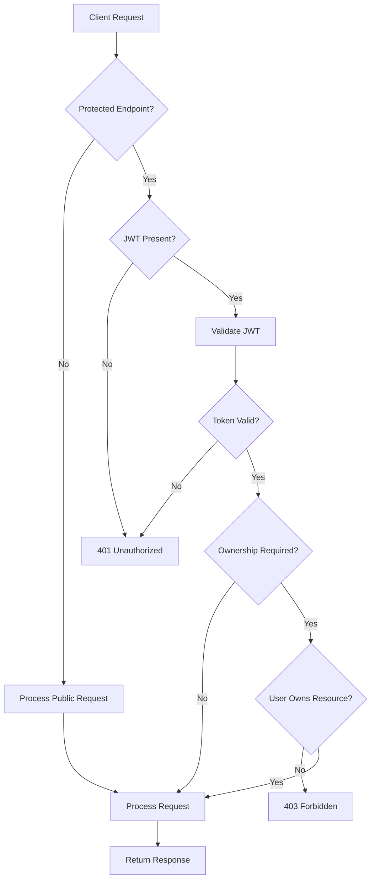

---

# 24. Deployment Architecture

The current project is designed around a containerized architecture.

### Current Environment

```text
Developer / User
       │
       ▼
Docker Compose
       │
       ├── React Frontend
       │
       ├── Flask Backend
       │
       └── PostgreSQL Database
```

### Future Production Architecture

A potential production deployment can evolve toward:

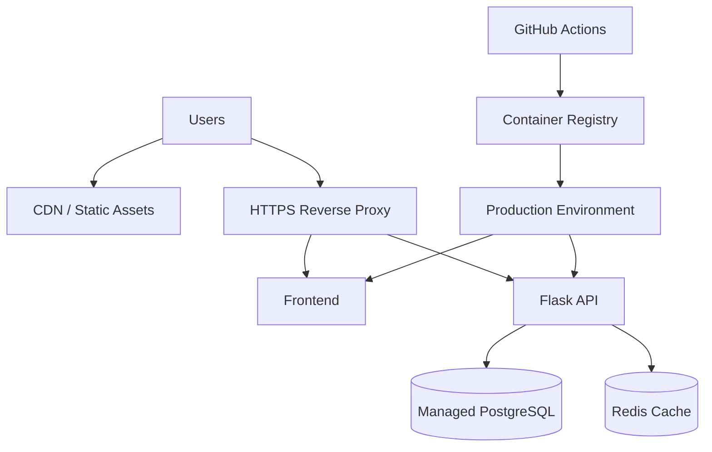

This represents a possible future architecture and is not necessarily part of the current deployment.

---

# 25. Architecture Summary

PasteVault follows a modular full-stack architecture:

```text
┌──────────────────────────────────────────────┐
│                  USER                        │
└──────────────────────┬───────────────────────┘
                       │
                       ▼
┌──────────────────────────────────────────────┐
│             REACT FRONTEND                   │
│              Vite / UI                       │
└──────────────────────┬───────────────────────┘
                       │ REST API
                       ▼
┌──────────────────────────────────────────────┐
│              FLASK REST API                  │
│                                              │
│  Authentication │ Authorization │ Validation  │
│                                              │
│            Application Logic                 │
└──────────────────────┬───────────────────────┘
                       │
                       ▼
┌──────────────────────────────────────────────┐
│             SQLALCHEMY ORM                   │
└──────────────────────┬───────────────────────┘
                       │
                       ▼
┌──────────────────────────────────────────────┐
│              POSTGRESQL                      │
│          Persistent Data Storage              │
└──────────────────────┬───────────────────────┘
                       │
                       ▼
┌──────────────────────────────────────────────┐
│         DOCKER PERSISTENT VOLUME             │
└──────────────────────────────────────────────┘


       ┌──────────────────────────────────┐
       │       SUPPORTING SYSTEMS         │
       │                                  │
       │  Flask-Migrate / Alembic         │
       │  Pytest                          │
       │  GitHub Actions                  │
       │  Docker Compose                  │
       └──────────────────────────────────┘
```

---

## Document Information

| Property              | Value                                                            |
| :-------------------- | :--------------------------------------------------------------- |
| **Project**           | PasteVault                                                       |
| **Document**          | System Architecture                                              |
| **Architecture Type** | Full-Stack Layered Architecture                                  |
| **Frontend**          | React + Vite                                                     |
| **Backend**           | Flask REST API                                                   |
| **Database**          | PostgreSQL                                                       |
| **ORM**               | SQLAlchemy                                                       |
| **Authentication**    | JWT                                                              |
| **Migrations**        | Flask-Migrate / Alembic                                          |
| **Testing**           | Pytest                                                           |
| **Containerization**  | Docker                                                           |
| **Orchestration**     | Docker Compose                                                   |
| **CI**                | GitHub Actions                                                   |
| **Status**            | Current architecture with future production evolution documented |